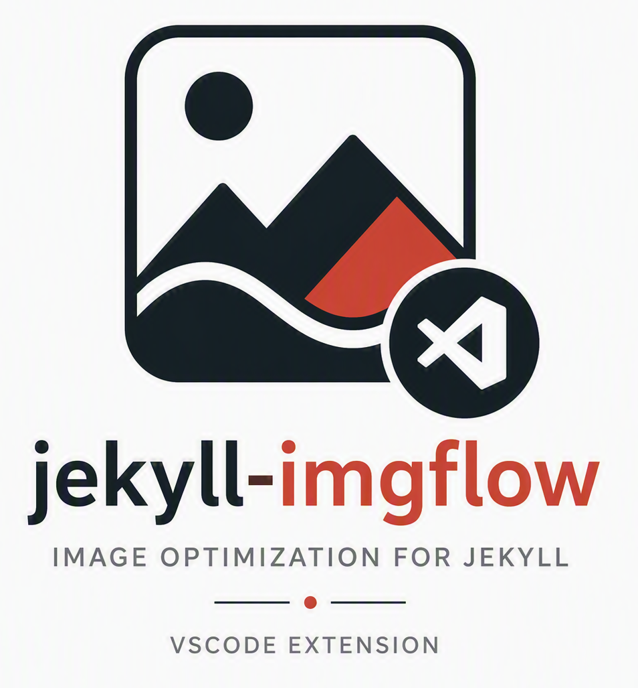

# ImgFlow



A [Jekyll](https://jekyllrb.com/) plugin for automatic image optimization with multiple providers and formats.

[](https://deepwiki.com/gundestrup/jekyll-imgflow)
[](https://github.com/gundestrup/jekyll-imgflow)
[](https://semgrep.dev/)
[](https://www.codefactor.io/repository/github/gundestrup/jekyll-imgflow)
[](https://sonarcloud.io/summary/new_code?id=gundestrup_jekyll-imgflow)
[](https://codecov.io/gh/gundestrup/jekyll-imgflow)
[](https://github.com/gundestrup/jekyll-imgflow-vscode)
[](LICENSE)

## 🚀 Quick Start

```bash
# Add to your Gemfile
gem 'jekyll-imgflow'

# Install
bundle install

# Configure (_config.yml) — only originals and output are required,
# everything else has sensible defaults:
imgflow:
  originals: "assets/images/originals"
  output: "assets/images/optimized"

# Use in templates

```

> **Configuration:** Only `originals` and `output` are required in `_config.yml`
> — everything else has sensible defaults. See the
> [Installation Guide](docs/installation.md#4-add-to-_configyml) for full options.

> **Note:** Image references require exact filenames (or paths relative to
> `originals`). There is no fuzzy matching during the build yet — if you type
> `photo.jpg` but the file is `photo.jpeg`, the build will fail with an error.
>
> For editor autocomplete while writing `` tags, install the
> [VS Code companion extension](https://github.com/gundestrup/jekyll-imgflow-vscode).

## ✨ Key Features

- **Multiple Providers**: [Sharp](https://github.com/lovell/sharp), [ImageMagick](https://github.com/ImageMagick/ImageMagick), [LibVips](https://github.com/libvips/libvips), [Imgproxy](https://github.com/imgproxy/imgproxy), [Weserv](https://github.com/weserv/images), [Flyimg](https://github.com/flyimg/flyimg)
- **Modern Formats**: WebP, AVIF, JPG, PNG with automatic fallbacks
- **Picture Tag Support**: Full [Jekyll Picture Tag](https://github.com/robwierzbowski/jekyll_picture_tag) compatibility
- **Build-Time Processing**: Pre-generate images for optimal performance
- **Docker Services**: Ready-to-use image processing containers
- **Parallel Testing**: Fast test execution with CPU optimization

## 📚 Documentation

### Getting Started
- **[Installation Guide](docs/installation.md)** - Detailed setup instructions
- **[Basic Usage](docs/usage/)** - Core functionality and examples
- **[Picture Tag Migration](docs/picture_tag_migration.md)** - Migrate from Picture Tag

### Configuration
- **[Provider Setup](docs/providers.md)** - Configure image providers
- **[Docker Services](docs/docker.md)** - Using Docker containers
- **[Presets System](docs/usage/presets.md)** - Predefined configurations

### Development
- **[Development Guide](docs/development.md)** - Contributing and setup
- **[Testing Guide](docs/testing.md)** - Running and writing tests
- **[Scripts Reference](docs/scripts.md)** - Development utilities

### Performance
- **[Provider Comparison](docs/providers.md)** - Performance benchmarks
- **[Parallel Testing](docs/parallel_testing.md)** - Fast test execution

## 🏗️ Architecture Overview

ImgFlow has two processing flows: **Build-Time** (pre-generation) and **Runtime** (on-demand).

**See:** [ARCHITECTURE.md](docs/ARCHITECTURE.md) for detailed component architecture and data flow

### Quick Overview
- **Build-Time Flow** - Pre-generate images during Jekyll build
- **Runtime Flow** - Process images on-demand during template rendering
- **Providers** - Image processing backends (CLI tools, HTTP APIs)
- **Tags** - Jekyll template tags for image optimization

## 🎯 Provider Support

### HTTP API Services (Recommended)
- **[Imgproxy](https://github.com/imgproxy/imgproxy)** - Fast, reliable (Port 4022)
- **[Weserv](https://github.com/weserv/images)** - Battle-tested (Port 4026)
- **[Flyimg](https://github.com/flyimg/flyimg)** - On-the-fly processing (Port 4030)

### CLI Tools (Local)
- **[Sharp](https://github.com/lovell/sharp)** - Node.js/libvips processing
- **[ImageMagick](https://github.com/ImageMagick/ImageMagick)** - Feature-rich
- **[LibVips](https://github.com/libvips/libvips)** - Memory efficient

**See:** [providers.md](docs/providers.md) for detailed provider comparison and setup

### SVG File Handling

SVG files are supported as input by all providers. Since SVGs are vector
graphics, they are rasterized before format conversion (WebP, AVIF, JPG, PNG).

- **Weserv** (via librsvg): When an SVG has no explicit pixel dimensions
  (e.g. `width="100%"` with a large `viewBox`), ImgFlow automatically
  caps the rasterization at 2000px wide to prevent memory exhaustion.
  If a resize or crop operation is present, the target dimensions are used
  directly.
- **Sharp, LibVips, Imgproxy, Flyimg**: Handle SVGs via their respective
  rasterization backends. SVGs with very large viewBox dimensions may be
  slow or fail depending on the provider's memory limits.
- **ImageMagick**: SVG processing is slower than other providers without
  the `librsvg` delegate installed. Set `FULL_SVG_TEST=true` to include
  SVGs in ImageMagick test runs.

SVGs with explicit `width` and `height` attributes (in pixels, not
percentages) are always processed at the specified size first, then resized
to the target dimensions — this is the recommended way to author SVGs for
image processing.

## 🚀 Quick Commands

```bash
# Development
bundle exec jekyll serve              # Start development server
bundle exec jekyll build              # Build site

# Testing
rake quick                           # Quick checks (style + tests)
rake test                            # All tests
rake parallel:test                   # Parallel testing (faster)

# Docker Services
rake start_services                  # Start services (pulls latest pinned images)
rake check_services                  # Verify services
```

**See:** [testing.md](docs/testing.md) for comprehensive testing guide, [scripts.md](docs/scripts.md) for development utilities, and [rake.md](docs/rake.md) for all available Rake tasks

## 📦 Installation

### Quick Setup
```bash
# Add to Gemfile
gem 'jekyll-imgflow'

# Install
bundle install

# Configure (_config.yml) — only originals and output required:
imgflow:
  originals: "assets/images/originals"
  output: "assets/images/optimized"
  # cache_dir defaults to ".cache/imgflow" (stores manifest, survives _site wipes)

# Use in templates


# Or use built-in presets:

```

**Built-in presets:** `gallery` (400px, avif/webp/jpg, Q80), `hero` (800px, avif/webp/jpg, Q85), `thumbnail` (150px, webp/jpg, Q75). They work without installation. To copy editable versions, add `require "jekyll-imgflow/tasks"` to the site's `Rakefile`, then run `rake imgflow:install_presets`.

**See:** [installation.md](docs/installation.md) for detailed installation and
[all configuration options](docs/installation.md#4-add-to-_configyml),
[presets.md](docs/usage/presets.md) for the preset system

## 🐳 Docker Setup (Recommended)

```bash
# Start all services (pulls latest pinned images first)
rake start_services

# Check services
rake check_services

# Check if pinned images are outdated (run before releases)
rake check_docker_images

# Stop services
rake stop_services
```

**See:** [docker.md](docs/docker.md) for detailed Docker configuration and services

## 🔄 Picture Tag Migration

ImgFlow provides full compatibility with [Jekyll Picture Tag](https://github.com/robwierzbowski/jekyll_picture_tag):

```bash
# Preview migration
bin/imgflow_migrate_presets --preview

# Migrate presets
bin/imgflow_migrate_presets
```

**See:** [Picture Tag Migration Guide](docs/picture_tag_migration.md)

## 📊 Performance

Latest benchmarks show **Sharp** as the fastest provider:

| Provider | Time (s) | Speed |
|----------|----------|-------|
| [Sharp](https://github.com/lovell/sharp) | 13.97 | 🏆 Fastest |
| [LibVips](https://github.com/libvips/libvips) | 21.89 | Very Fast |
| [Weserv](https://github.com/weserv/images) | 30.19 | Fast |
| [ImageMagick](https://github.com/ImageMagick/ImageMagick) | 30.62 | Fast |
| [Imgproxy](https://github.com/imgproxy/imgproxy) | 31.27 | Fast |

**See:** [Provider Comparison](docs/providers.md) for detailed benchmarks

## 🛠️ Development

### Quick Setup
```bash
# Clone and setup
git clone <repository>
cd jekyll-imgflow
bundle install

# Download test images
rake download_test_images

# Run the CI-equivalent checks locally
rake ci

# Run the local Semgrep Pro rules directly
semgrep scan --pro --config .semgrep.yml --error lib/

# Sync the repository scan and findings with the Semgrep dashboard
# (requires semgrep login or SEMGREP_APP_TOKEN)
semgrep ci
```

### Key Files
- **`lib/jekyll-imgflow.rb`** - Main module
- **`lib/jekyll-imgflow/imgflow_tag.rb`** - Main tag implementation
- **`lib/jekyll-imgflow/html_generator.rb`** - HTML generation
- **`lib/jekyll-imgflow/picture_tag_adaptor.rb`** - Picture Tag compatibility

**See:** [development.md](docs/development.md) for complete development setup, scripts, and workflows

## 🤝 Contributing

1. Fork the repository
2. Create a feature branch
3. Make your changes
4. Add tests for new functionality
5. Run `rake quality` to check all quality metrics
6. Submit a pull request

**See:** [development.md](docs/development.md) for detailed guidelines and [scripts.md](docs/scripts.md) for development utilities

## 📄 License

This project is licensed under the AGPL-3.0-or-later License - see the [LICENSE](LICENSE) file for details.

## 🔗 Links

- **[Documentation](docs/README.md)** - Complete documentation
- **[GitHub Repository](https://github.com/gundestrup/jekyll-imgflow)** - Source code
- **[Issue Tracker](https://github.com/gundestrup/jekyll-imgflow/issues)** - Report issues
- **[Releases](https://github.com/gundestrup/jekyll-imgflow/releases)** - Latest versions

---

**ImgFlow** - Fast, flexible image optimization for Jekyll sites 🚀
